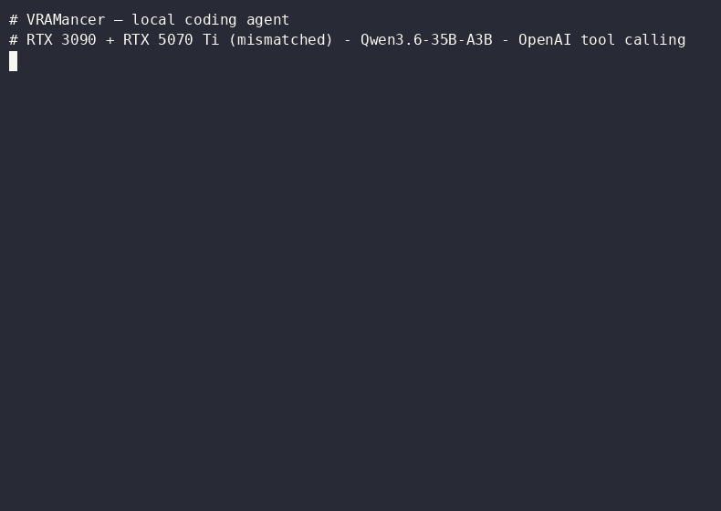

<p align="center">
  
</p>

# VRAMancer

Run LLM models that don't fit on a single GPU, across heterogeneous GPUs, in one command.

```bash
# Load a 14B model across a RTX 3090 + RTX 5070 Ti (neither alone has enough VRAM)
vramancer run Qwen/Qwen2.5-14B-Instruct

# With 4-bit quantization (fits on a single GPU, ~70% less VRAM)
vramancer run Qwen/Qwen2.5-14B-Instruct -q nf4

# One-shot generation
vramancer run Qwen/Qwen2.5-7B-Instruct -p "Explain gradient descent in 3 sentences"
```

VRAMancer auto-detects all GPUs and runs the model across them using the standard engines — HuggingFace `accelerate` (`device_map="auto"`), llama.cpp, or vLLM — with a compute-aware `max_memory` map that avoids the load-time OOM tight-fit models hit. It is an **orchestration + UX layer** on top of those engines (it does not reimplement the inference engine), plus measured optimisations (prompt-lookup decoding, KV compression, a VRAM lending pool). No config files, no YAML, no manual device maps.

## What we measured that *didn't* work

Seven investigations were run to the end, measured, and **refuted**. They are published
rather than buried — the numbers below are the same ones that killed features we wanted
to ship:

| Idea | Prediction | Measured | Verdict |
|------|-----------|----------|---------|
| Weight tiering, dense (Rust `GpuPipeline`) | > 90% of reference throughput | **61%** | ❌ per-call overhead dominates |
| Weight tiering, dense (best variant, torch double-buffer) | — | **73.1%** | ❌ `accelerate` still does better |
| MoE hot/cold expert tiering | "the differentiator" | expert use is **quasi-uniform** (top-8 coverage 15.3% vs 13.3% uniform) | ❌ refuted by design of MoE load-balancing |
| Prefill/decode disaggregation | worth splitting | decode-dominated **58:1** | ❌ no room |
| Direct GPU↔GPU P2P on consumer cards | DMA path | `CUDA_ERROR_PEER_ACCESS_UNSUPPORTED` (217) | ❌ not available without NVLink |
| A *custom* cross-vendor transport (AMD↔NVIDIA) | our own bridge would beat the alternatives | llama.cpp Vulkan already pairs a RTX 3090 with a RX 7900 XT out of the box — and pairing is worth **4.4×** when the model only fits in combined VRAM (20.7 → 91.7 tok/s) | ❌ don't write the bridge — **do** use the pair ([report](docs/reports/D3D_CROSS_VENDOR_VERDICT.md)) |
| Cross-node sharding before a real 2nd machine | — | never measured | ⏸ not claimed until it is |

Full write-up, raw numbers and the reasoning: **[docs/history/phase7-tiering-2026-06/SYNTHESE.md](docs/history/phase7-tiering-2026-06/SYNTHESE.md)**.

Hardware advice that falls out of that row, measured rather than assumed: **a second GPU
from a different vendor is a perfectly good buy** — but only when it moves your model
under the *combined* VRAM ceiling. Measured on a 3090 + 7900 XT:

| Your model… | Mixing vendors |
|---|---|
| fits on your fastest card | costs you 32% — use the one card |
| **fits only in the two cards combined** (MoE, Qwen3.6-35B Q6_K) | **4.4× (20.7 → 91.7 tok/s)**, 106 with `tune-split` |
| **fits only in the two cards combined** (dense, Qwen2.5-Coder-32B Q6_K) | **7.5× (3.7 → 27.9 tok/s)** |
| exceeds both cards combined | +28%, still unusable (1.08 → 1.38 tok/s) |
| duplicated on each card (data-parallel) | +7% under heavy load only |

The combined-VRAM rows are where this project lives: they let you run a 27 GB Q6_K instead
of a 20 GB Q4_K_M, at 92–106 tok/s, on cards nobody would call a matched pair.

**Don't split by VRAM — split by speed.** Splitting layers in proportion to each card's VRAM
(llama.cpp's default) leaves a lot on the table when the cards aren't equally fast: layers
run one after another, so the fast card should take as many as it can hold.
`vramancer tune-split` measures it once (a few `llama-bench` runs at your real context
length, guarding against prefill collapse) and `serve` reuses the result:
**+28% end-to-end** through `vramancer serve` on a 3090 + 7900 XT (74.5 → 95.7 tok/s).

```bash
vramancer tune-split model.gguf --ctx 16384            # local GPUs, any vendor mix
vramancer tune-split model.gguf --rpc 192.168.1.20:50052   # + a GPU on another machine
```

**Bigger than your VRAM? Place by read intensity.** `vramancer plan model.gguf` reads the
GGUF header, then with 2–3 short measurements fills the tiers fastest-first: for a MoE,
the always-read tensors (attention, shared expert) go on the fastest GPU and the routed
experts (~3% read per token) spill to the second GPU, then RAM. `serve` reuses the plan and
falls back to a safer placement instead of failing. Measured: **DeepSeek-V4-Flash (81 GiB)
on a 3090 + 7900 XT + RAM at 11.8 tok/s**, prediction within 3.3%; ~9.7 tok/s seen by an
API client. ([measurements](docs/reports/PLANIFICATEUR_COUT_2026-09-23.md))

**Two machines work too.** With llama.cpp RPC and real GPUs behind a shaped link, a 3090
plus a remote 7900 XT lose only ~4% over plain gigabit Ethernet (93.8 tok/s), 25% over
Wi-Fi — on a model neither machine can hold alone. ([measurements](docs/reports/TESTS_7900XT_JOUR2_2026-09-23.md))

What survived is what this project actually is: **orchestration across mismatched GPUs on
top of accelerate/llama.cpp/vLLM**, plus the optimisations that *did* measure (prompt-lookup
decoding, KV compression, VRAM lending pool, continuous batching).

## Benchmarks

### Multi-GPU inference — heterogeneous split (RTX 3090 + RTX 5070 Ti)

| Model | Params | VRAM | tok/s | Notes |
|-------|--------|------|-------|-------|
| Qwen2.5-14B BF16 | 14B | 35.9 GB | **5.41** | 2-GPU via accelerate `device_map`, OOMs on either GPU alone ([methodology](BENCHMARK_RESULTS.md)) |
| Qwen2.5-14B NF4 | 14B | 10.8 GB | **10.5** | 1 GPU, bitsandbytes, ~70% less VRAM — and faster than BF16-2GPU (no cross-GPU transfer overhead) |
| **Qwen3-Coder-Next Q3** | **80B (3B active)** | **38 GB** | **~60** | GGUF Q3_K_XL, 2-GPU tensor split, MoE |
| Qwen2.5-7B GGUF Q4_K_M | 7B | 4.5 GB | **106.8** | llama.cpp, 1 GPU |

> Qwen3-Coder-Next: 80B MoE model (3B active params per token), GGUF Q3_K_XL split across RTX 3090 (23.4 GB) + RTX 5070 Ti (15 GB). First token: 66–92 ms. It runs faster than the 14B dense row above because only ~3B params are computed per token (MoE sparsity), not because of any VRAMancer-specific trick — llama.cpp does the work.

### GPU-to-GPU transfer bandwidth

On these consumer GPUs (RTX 3090 Ampere + RTX 5070 Ti Blackwell, no NVLink, VFIO
passthrough), **direct GPU↔GPU P2P is not available** — measured: `can_device_access_peer()`
returns False, and the driver call `cuCtxEnablePeerAccess` returns
`CUDA_ERROR_PEER_ACCESS_UNSUPPORTED` (217). So **all transfers are CPU-staged** (through
pinned host RAM over PCIe). The Rust pipeline just does it faster via double-buffered
pinned memory:

| Method | Bandwidth | Notes |
|--------|-----------|-------|
| Rust pinned double-buffer (`GpuPipeline`) | ~25 GB/s | CPU-staged, overlapped (large contiguous transfers) |
| PyTorch `.to()` | ~11.6 GB/s | CPU-staged, naive (measured, 256 MB) |

There is no P2P DMA path here; a faster transport would need NVLink or, for cross-node,
Thunderbolt/USB4 (~16–20 Gbps).

### KV cache migration (VRAM Lending Pool preemption)

Simulates evicting KV pages from GPU 1 → GPU 0 when a lending GPU reclaims its VRAM.
Page size: 3 MB (Qwen2.5-14B: 48L × 8kv × 16tok × 128dim × bf16).

| Scenario | CPU-staged | Rust P2P | Speedup |
|----------|-----------|----------|---------|
| 10 pages (30 MB) | ~8 ms | ~4 ms | +47% |
| 100 pages (300 MB) | ~28 ms | ~15 ms | +46% |
| 500 pages (1.5 GB) | ~116 ms | ~61 ms | **+47%** |

### Single-GPU overhead — near-zero

| Model | HuggingFace native | VRAMancer | Delta |
|-------|-------------------|-----------|-------|
| GPT-2 (124M) | 123.4 tok/s | 125.6 tok/s | +1.8% |
| TinyLlama-1.1B | 53.0 tok/s | 56.5 tok/s | **+6.6%** |
| Mistral-7B-v0.1 | 35.1 tok/s | 34.9 tok/s | -0.6% |

### WebNPU (browser inference via WebNN)

| Device | Backend | tok/s |
|--------|---------|-------|
| Samsung S25 Ultra (Hexagon NPU) | WebNN via WebNPU | **67.4** |
| MacBook M4 | WebGPU | ~45 |

_Hardware: RTX 3090 (24 GB, PCIe 4.0) + RTX 5070 Ti (16 GB, PCIe 5.0), Proxmox VM, VFIO passthrough._

Full benchmark scripts: [benchmarks/](benchmarks/)

## Install

One-liner (detects your GPU/CUDA, sets up an isolated venv, installs the matching
PyTorch wheel, builds the Rust core, and adds the `vramancer` command):

**Linux / macOS**
```bash
curl -fsSL https://raw.githubusercontent.com/thebloodlust/VRAMancer/main/install.sh | bash
vramancer quickstart code-assistant      # picks a model that fits your hardware
```

**Windows (PowerShell)**
```powershell
irm https://raw.githubusercontent.com/thebloodlust/VRAMancer/main/install.ps1 | iex
vramancer quickstart code-assistant
```

Both wrap the same cross-platform `install.py` auto-detector (Linux → CUDA/ROCm/CPU,
macOS → MPS, Windows → CUDA/CPU).

Or manually:

```bash
git clone https://github.com/thebloodlust/VRAMancer.git
cd VRAMancer
pip install -e .
```

Requires Python 3.10+, an NVIDIA driver (for CUDA), PyTorch 2.1+. The installer wraps
the existing `install.py` auto-detector; it does not bundle PyTorch/CUDA into a binary
(the host NVIDIA driver is kernel-level and cannot be bundled).

### Platform-specific setup

<details>
<summary><strong>Linux + NVIDIA GPU (CUDA)</strong></summary>

```bash
git clone https://github.com/thebloodlust/VRAMancer.git
cd VRAMancer
python -m venv .venv && source .venv/bin/activate

# PyTorch with CUDA 12.8
pip install torch torchvision --index-url https://download.pytorch.org/whl/cu128

# VRAMancer + dependencies
pip install -e .[gpu]

# Verify
python -c "import torch; print(f'CUDA: {torch.cuda.is_available()}, GPUs: {torch.cuda.device_count()}')"
vramancer status
```

**Optional backends:**
```bash
pip install llama-cpp-python    # GGUF models (fast — 106 tok/s on a 7B here)
pip install bitsandbytes        # NF4/INT8 quantization
pip install vllm                # Batched serving
```

**Multi-GPU test (e.g. RTX 3090 + RTX 5070 Ti):**
```bash
# Model that doesn't fit on a single GPU
vramancer run Qwen/Qwen2.5-14B-Instruct

# With quantization (fits single GPU)
vramancer run Qwen/Qwen2.5-14B-Instruct -q nf4
```

</details>

<details>
<summary><strong>macOS Apple Silicon (M1/M2/M3/M4)</strong></summary>

```bash
git clone https://github.com/thebloodlust/VRAMancer.git
cd VRAMancer
python3 -m venv .venv && source .venv/bin/activate

# PyTorch with MPS support (included by default on macOS)
pip install torch torchvision

# VRAMancer + dependencies
pip install -e .

# Verify MPS backend
python -c "import torch; print(f'MPS: {torch.backends.mps.is_available()}')"
vramancer status
```

**Run the MPS test suite:**
```bash
python scripts/test_mps_mac.py
```

This tests:
- MPS backend detection (`detect_backend()` returns `mps`)
- GPT-2 124M inference on MPS
- TinyLlama 1.1B inference on MPS (~4 GB unified memory)
- Full stub test suite (`VRM_MINIMAL_TEST=1 pytest tests/ -m "not gpu and not real_torch and not heavy and not chaos"`)

**Run models:**
```bash
# Small models (16 GB unified memory)
vramancer run gpt2
vramancer run TinyLlama/TinyLlama-1.1B-Chat-v1.0

# GGUF recommended for larger models on Mac
pip install llama-cpp-python
vramancer run bartowski/Qwen2.5-7B-Instruct-GGUF
```

</details>

<details>
<summary><strong>Windows + NVIDIA GPU</strong></summary>

```bash
git clone https://github.com/thebloodlust/VRAMancer.git
cd VRAMancer
python -m venv .venv && .venv\Scripts\activate

# PyTorch with CUDA 12.8
pip install torch torchvision --index-url https://download.pytorch.org/whl/cu128

# VRAMancer + dependencies
pip install -e .[windows]

# Verify
python -c "import torch; print(f'CUDA: {torch.cuda.is_available()}')"
vramancer status
```

</details>

### RTX 4060 (8 GB) benchmark

For smaller GPUs like the RTX 4060 8 GB:

```bash
# Run the benchmark script
python scripts/bench_rtx4060.py
```

Tests GPT-2 FP16, TinyLlama 1.1B FP16, Qwen2.5-7B NF4 (~5 GB), and GGUF via llama.cpp.

## Local coding assistant

Run a **coding agent** (Aider, Cline, Continue) on a local model, on mismatched consumer
GPUs, with **OpenAI-compatible tool calling** — validated end-to-end (a real Aider session
edits code and updates tests, unassisted):

<p align="center">
  
</p>

```bash
./serve_qwen36.sh                              # Qwen3.6-35B-A3B on 2 GPUs, API on :5030

pip install aider-chat
OPENAI_API_BASE=http://localhost:5030/v1 OPENAI_API_KEY=dummy \
  aider --model openai/qwen3.6-coder --no-stream
```

**Prompt-lookup, automatically — but only where it helps.** An agent rewriting a file
mostly copies its own prompt, so speculative decoding by n-gram lookup is a large, exact
(same output) speed-up: **7.5× on a whole-file edit** with a dense 32B model split across
two GPUs (73.9 s → 11.6 s). On a **MoE** model it does the opposite — **−65%** — because
verifying a batch of drafted tokens wakes different experts for each one. `--profile coding`
reads the GGUF header and enables it for dense models only (`VRM_SPEC=ngram|off` to force).

Function calling works (parses Qwen's `<tool_call>` format → OpenAI `tool_calls`), the full
tool round-trip is handled, and malformed calls never escape. Full guide, other agents
(Cline/Continue), pitfalls and measured perf: **[docs/coding_agents.md](docs/coding_agents.md)**.

**Agent client compatibility** — only what was actually run is marked validated:

| Client | Status | Notes |
|--------|--------|-------|
| **Aider** (`--no-stream`) | ✅ validated end-to-end | Real session edits code and updates tests, reproduced 3×; see [C1_AIDER_FINDINGS.md](docs/sessions/C1_AIDER_FINDINGS.md) |
| Cline | ⬜ not tested — [report it](../../issues/new?template=agent_compat.md) | Should work via the OpenAI API; nobody has run it here |
| Continue | ⬜ not tested — [report it](../../issues/new?template=agent_compat.md) | idem |
| OpenWebUI | ⬜ not tested — [report it](../../issues/new?template=agent_compat.md) | idem |
| Any client requiring **streamed tool-calls** | ❌ not implemented | Deliberately frozen until a real client needs it — [say so in an issue](../../issues/new?template=agent_compat.md) and it gets unfrozen |

A "it's broken" report is as useful as a "it works": both move a row out of the ⬜ column.

> Perf note: the coding path runs through **llama.cpp/GGUF**. The prompt-lookup +500% number
> was measured on the HuggingFace backend, not this path — see [BENCHMARK_RESULTS.md](BENCHMARK_RESULTS.md).

## Usage

### One-command inference (recommended)

```bash
# Interactive mode — loads model, then prompts you
vramancer run Qwen/Qwen2.5-7B-Instruct

# One-shot with prompt
vramancer run mistralai/Mistral-7B-v0.1 -p "What is VRAM?" --max-tokens 128

# With quantization (nf4, int8, nvfp4 for Blackwell)
vramancer run Qwen/Qwen2.5-14B-Instruct -q nf4

# Force specific GPU count
vramancer run meta-llama/Llama-3-8B --gpus 2

# GGUF models auto-select llama.cpp (faster than HF for GGUF: ~106 vs ~35 tok/s on a 7B here)
vramancer run bartowski/Qwen2.5-7B-Instruct-GGUF
```

### API server (OpenAI-compatible)

```bash
# Start server with model pre-loaded
vramancer serve --model Qwen/Qwen2.5-7B-Instruct --port 5030

# Then query it
curl http://localhost:5030/v1/completions \
  -H "Content-Type: application/json" \
  -H "Authorization: Bearer $VRM_API_TOKEN" \
  -d '{"prompt": "Hello", "max_tokens": 64}'
```

### Other commands

```bash
vramancer doctor      # Full diagnostic (GPU, P2P, versions, health) — measured numbers only
vramancer status      # Show GPUs, memory, backend
vramancer health      # System health check
vramancer dashboard   # Real-time web dashboard (GPU/VRAM/tok-s)
vramancer history     # Recent requests (tok/s, OOM, trends)
vramancer hub Qwen/Qwen2.5-14B-Instruct  # Browse model formats on HF
vramancer benchmark   # Measured GFLOPS / memory bandwidth per GPU
vramancer split Qwen/Qwen2.5-14B-Instruct --gpus 2  # Preview model split
vramancer tune-split model.gguf  # Measure the best layer split across mismatched GPUs
vramancer plan model.gguf        # Place weights by tier (GPUs → RAM), measured, reused by serve
```

### Cluster (data-parallel across GPUs)

```bash
# Data-parallel: one worker process per GPU, requests routed by work-stealing (~2× on 2 GPUs).
vramancer cluster serve Qwen/Qwen2.5-14B-Instruct   # OpenAI API on :5040, dashboard on :5041/dash
```

Auto-restarts dead workers, records history, alerts on failure (`VRM_ALERT_WEBHOOK`).

#### Add another machine to the cluster (multi-node)

Each machine joins with **one command** — the installer pulls inference + mDNS by default,
so the node auto-announces on the LAN. Works across backends (a Mac MPS node + a CUDA node
cooperate; the gateway only speaks HTTP).

```bash
# 1. On the new machine (laptop / Mac / desktop) — one command:
curl -fsSL https://raw.githubusercontent.com/thebloodlust/VRAMancer/main/install.sh | bash
#    (Windows: irm https://raw.githubusercontent.com/thebloodlust/VRAMancer/main/install.ps1 | iex)

# 2. Run a node on that machine (it announces itself via mDNS):
vramancer serve Qwen/Qwen2.5-7B-Instruct --port 5040

# 3. On any machine, start the gateway — it discovers nodes and routes whole requests:
vramancer cluster gateway --discover
#    or explicitly: vramancer cluster gateway --nodes http://laptop.local:5040,http://mac.local:5040
```

> Not a GUI "1-click" (it's one terminal command): a true single binary can't bundle
> PyTorch/CUDA + the kernel-level GPU driver. The installer is the honest equivalent.

The same brick is also the foundation for cross-vendor (NVIDIA+AMD in one box) — pending an
AMD GPU. See [docs/CLUSTER.md](docs/CLUSTER.md).

## How it works

1. **Auto-detect GPUs** — enumerates all CUDA/ROCm/MPS devices with free VRAM
2. **Compute-aware memory map** — computes a `max_memory` budget per GPU (favouring the faster GPU) and hands it to `accelerate` / llama.cpp / vLLM, which do the actual layer placement and dispatch. This avoids the fp32-upcast OOM that the naive 97% formula triggers on tight-fit models.
3. **Inference via the chosen engine** — accelerate runs the forward pass (pipeline-parallel across GPUs); VRAMancer does not reimplement it.
4. **Quantization** — optional NF4/INT8/NVFP4 to reduce VRAM footprint
5. **KV cache management** — paged attention with optional PolarQuant+QJL compression (~3.5 bits/dim, ~4.6x reduction)

> Honest scope: VRAMancer's value is the orchestration, the OOM-avoiding placement, the
> measured optimisations and the UX (one-command install, `quickstart`, `doctor`, dashboard,
> mDNS cluster) — **not** a from-scratch inference engine. Weight-tiering, MoE expert
> streaming and prefill/decode disaggregation were prototyped and **measured to not beat
> the standard engines** on this hardware; they are not claimed as features.

## Backends

| Backend | Install | Best for |
|---------|---------|----------|
| **llamacpp** (recommended) | `pip install llama-cpp-python` | GGUF models, fast inference (106 tok/s on a 7B here) |
| **huggingface** | `pip install transformers accelerate` | General use, multi-GPU split |
| **vllm** | `pip install vllm` | High-throughput batched serving |
| **ollama** | Install [Ollama](https://ollama.ai) | Easy local models |

> **Tip:** GGUF models are auto-detected and use llama.cpp automatically. For HuggingFace models, add `--backend llamacpp` isn't needed — just use a GGUF repo name.

### Compatibility matrix

| Backend / Feature | Linux x86_64 | macOS (arm64) | Windows | NVIDIA (CUDA) | AMD (ROCm) | Apple Silicon (MPS) | CPU-only |
|---|---|---|---|---|---|---|---|
| huggingface | ✅ | ✅ | ✅ | ✅ | ✅ | ✅ | ✅ (slow) |
| llamacpp (GGUF) | ✅ | ✅ | ✅ | ✅ | ✅ | ✅ (Metal) | ✅ |
| vllm | ✅ | ❌ | ⚠️ WSL2 | ✅ | ⚠️ exp. | ❌ | ❌ |
| ollama | ✅ | ✅ | ✅ | ✅ | ✅ | ✅ | ✅ |
| NVFP4 (Blackwell FP4) | ✅ | ❌ | ✅ | ✅ SM ≥10.0 | ❌ | ❌ | ❌ |
| NF4 / INT8 (bitsandbytes) | ✅ | ⚠️ | ✅ | ✅ | ⚠️ | ❌ | ❌ |
| TurboQuant KV (PolarQuant+QJL) | ✅ | ✅ | ✅ | ✅ | ✅ | ✅ | ✅ |
| Multi-GPU pipeline parallel | ✅ | N/A | ✅ | ✅ | ✅ | N/A | N/A |
| Multi-GPU tensor parallel (NCCL) | ✅ | ❌ | ⚠️ | ✅ | ⚠️ | ❌ | ❌ |
| VRAM Lending Pool | ✅ | N/A | ✅ | ✅ (P2P or ReBAR) | ⚠️ | N/A | N/A |
| Rust pinned GPU transfer (CUDA FFI) | ✅ | ❌ | ❌ | ✅ | ❌ | ❌ | ❌ |
| Continuous batcher | ✅ | ✅ | ✅ | ✅ | ✅ | ✅ | ✅ |

Legend: ✅ supported & tested · ⚠️ partial / experimental · ❌ not supported · N/A not applicable.

> BnB (NF4/INT8) multi-GPU has an upstream bug in `accelerate 1.13 + transformers 5.3` — VRAMancer forces single-GPU for BnB. Use NVFP4 or GGUF Q4_K_M for multi-GPU quantized inference.

## Configuration

VRAMancer is configured via environment variables (`VRM_*`), not config files:

```bash
VRM_QUANTIZATION=nf4          # Quantization mode
VRM_KV_COMPRESSION=turboquant # KV cache compression (~4.6x reduction)
VRM_PARALLEL_MODE=pp           # pp (pipeline) or tp (tensor parallel)
VRM_API_TOKEN=your-token       # API authentication
VRM_PRODUCTION=1               # Strict security mode
```

Full list: [.github/copilot-instructions.md](.github/copilot-instructions.md#variables-denvironnement-essentielles)

## Development

```bash
# Stub tests (no GPU required)
VRM_MINIMAL_TEST=1 VRM_DISABLE_RATE_LIMIT=1 pytest tests/ -m "not gpu and not real_torch and not heavy and not chaos" -q

# GPU integration tests (requires CUDA/ROCm/MPS)
VRM_MINIMAL_TEST=1 VRM_DISABLE_RATE_LIMIT=1 pytest tests/ -m "gpu or real_torch" -q

# Lint
flake8 core/ tests/
```

## Architecture

```
vramancer run model
    └─ InferencePipeline
        ├─ backends.select_backend()  → HuggingFace / vLLM / Ollama / llama.cpp
        ├─ model_splitter             → VRAM-proportional layer assignment
        ├─ TransferManager            → GPU-to-GPU data movement (P2P or CPU-staged)
        ├─ StreamManager              → prefetch, swap, eviction
        └─ continuous_batcher         → batched inference (optional)
```

Detailed architecture: [docs/architecture.md](docs/architecture.md)

## Known limitations & technical debt

See [docs/reports/TECHNICAL_DEBT.md](docs/reports/TECHNICAL_DEBT.md) for documented stubs,
known limitations (BnB multi-GPU upstream bug, CUDA Graph single-GPU only, etc.) and V4 plan outcomes.

## License

MIT
